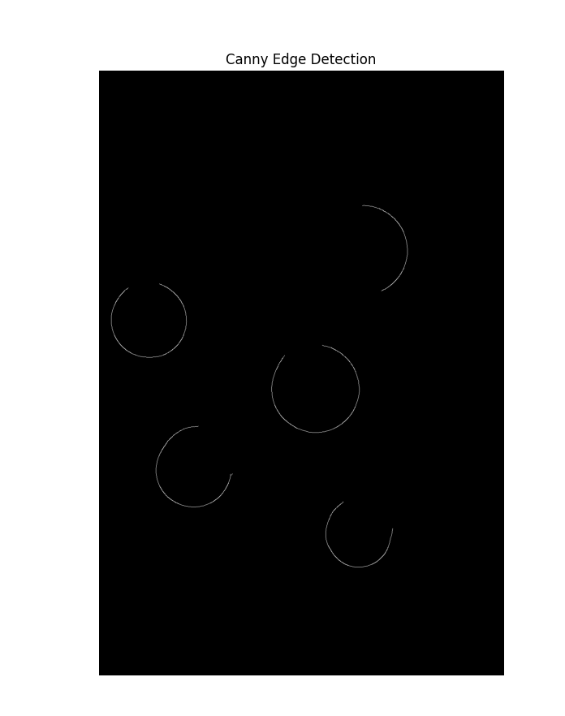
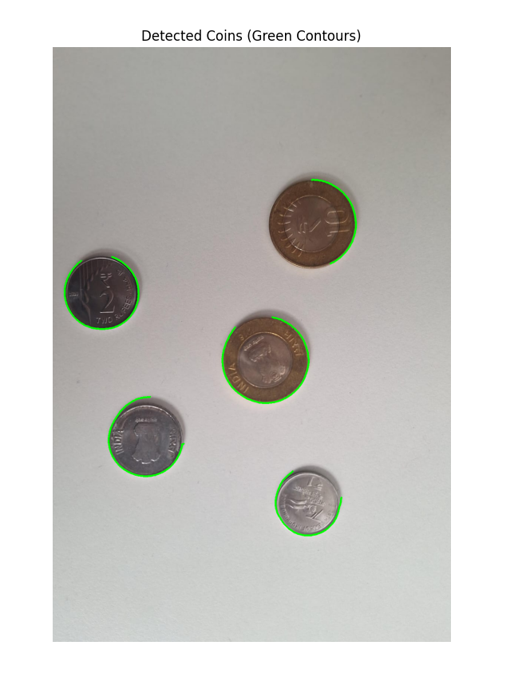
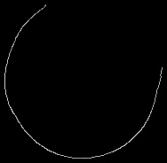
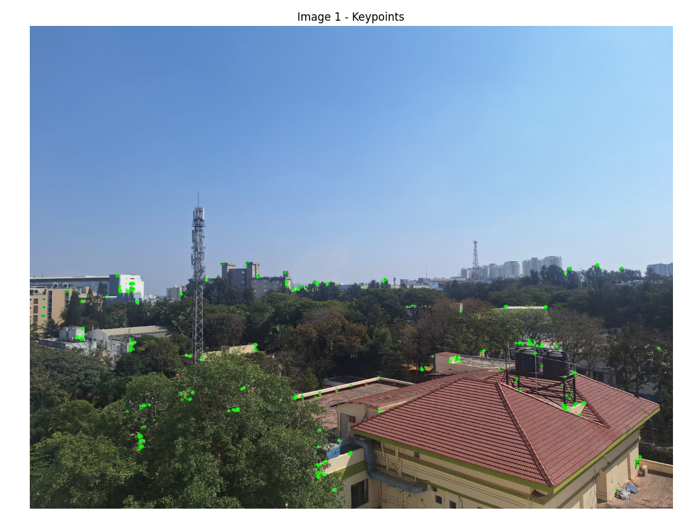
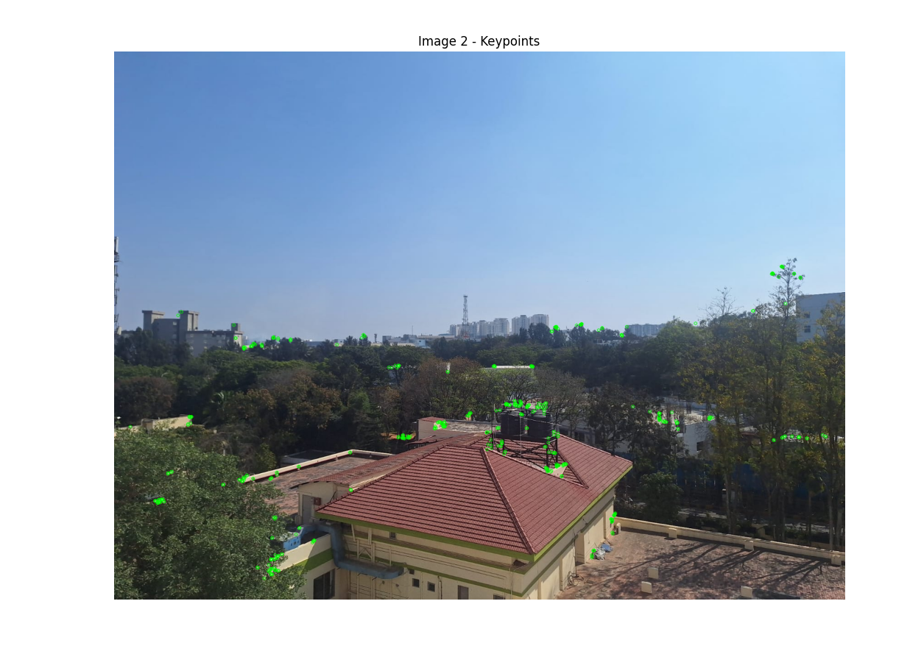
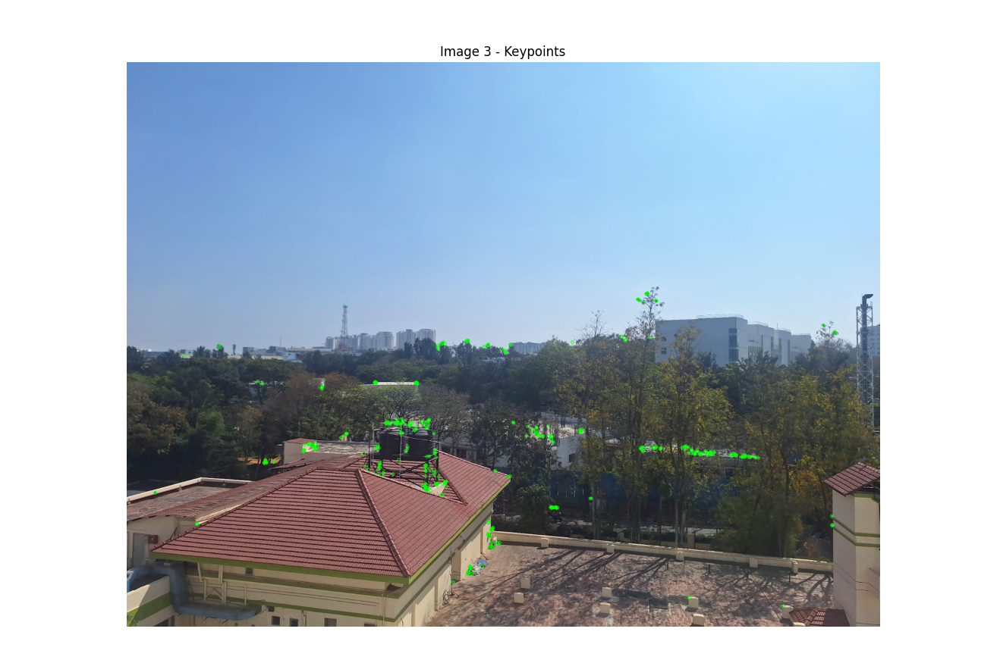
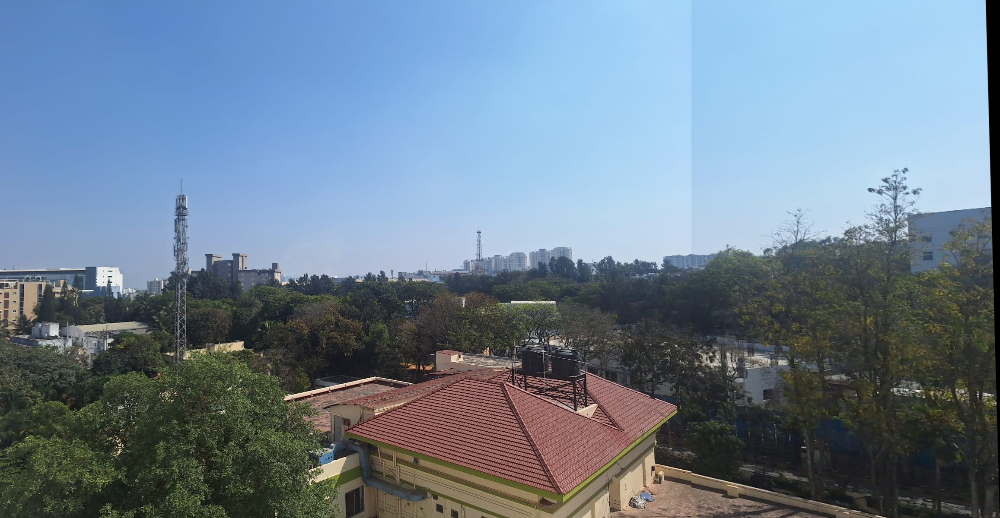

# VR_Assignment1_SamyakJain_IMT2022071

# Coin Detection and Panorama Stitching Project
## My Github Link: https://github.com/Samyakjnz/VR_Assignment1_SamyakJain_IMT2022071.git

This project involves two main tasks:

1. **Coin Detection and Segmentation**: Detecting and counting scattered Indian coins in images using computer vision techniques.
2. **Panorama Stitching**: Stitching multiple overlapping images into a single panoramic image using key points detection and image alignment.

---
## Part 1: Coin Detection and Segmentation

In Part 1, we work with an image containing scattered Indian coins. This image serves as the input data for detecting and segmenting the coins.

- **Input Image**: The image used for coin detection is a simple photograph of scattered Indian coins.
- **Image Filename**: `coinsIMAGE.jpg`
- **Image Description**: The image is taken in a controlled environment with good lighting, ensuring clear visibility of the coins. The coins are scattered in different orientations and partially overlapping, which adds a challenge for accurate detection.

### Example Input Image
Here’s the input image that is used in Part 1:


#### 1. Canny Edge Detection
This image shows the edges detected using the Canny algorithm. The edges are the initial step in identifying the coins.



#### 2. Contours of Detected Coins
This image shows the contours drawn around each detected coin. The coins are highlighted with green lines.



#### 3. Segmented Coins
This image shows each coin individually isolated after segmentation.



#### 4. Coins Detection
This shows the correct number of coins being detected.


### **Observations**
- The **Canny Edge Detection** successfully detects the edges of the coins, but overlapping regions may introduce noise.
- The **contour detection** method effectively identifies coin boundaries, though minor inaccuracies may occur due to lighting variations.
- **Segmentation results** are mostly accurate, but coins that overlap significantly may be harder to distinguish.
- The final detection count aligns well with the expected number of coins, proving the method’s reliability in standard conditions.

---

## Part 2: Panorama Stitching

In this part, multiple overlapping images are stitched together into a single panoramic image. Key points are extracted from the images, matched, and used to compute a homography matrix to align the images. The resulting panorama is cropped to remove black borders.

### Steps:
1. **Extract Key Points**: Key points from overlapping images are detected using the ORB detector.
2. **Image Stitching**: The images are aligned and stitched together using the matched key points and homography transformation.
3. **Cropping the Final Panorama**: Any black borders on the final stitched image are cropped to provide a clean output.

### Visual Output for Part 2

#### 1. Key Points Detection
This image shows the key points detected in the overlapping images using the ORB detector.





#### 2. Final Stitched Panorama
This is the final stitched panorama image, showing the result of aligning and stitching the images together.



### **Observations**
- The **key points detection** using ORB provides good feature matching between overlapping images, but low-texture regions may have fewer key points.
- The **homography transformation** correctly aligns images, though minor distortions can appear at the seams.
- The final **stitched panorama** effectively blends multiple images, but uneven lighting or perspective differences may impact the seamlessness of the stitching.
- Cropping is necessary to remove black borders, ensuring a cleaner final output.

---
## Dependencies

To run this project, you need to have the following dependencies installed:

1. **OpenCV** - A library for computer vision tasks like image processing and manipulation.
   - Install using:
     ```bash
     pip install opencv-python
     ```

2. **NumPy** - A package for numerical computing in Python.
   - Install using:
     ```bash
     pip install numpy
     ```

3. **Matplotlib** - A plotting library for creating static, animated, and interactive visualizations in Python.
   - Install using:
     ```bash
     pip install matplotlib
     ```

