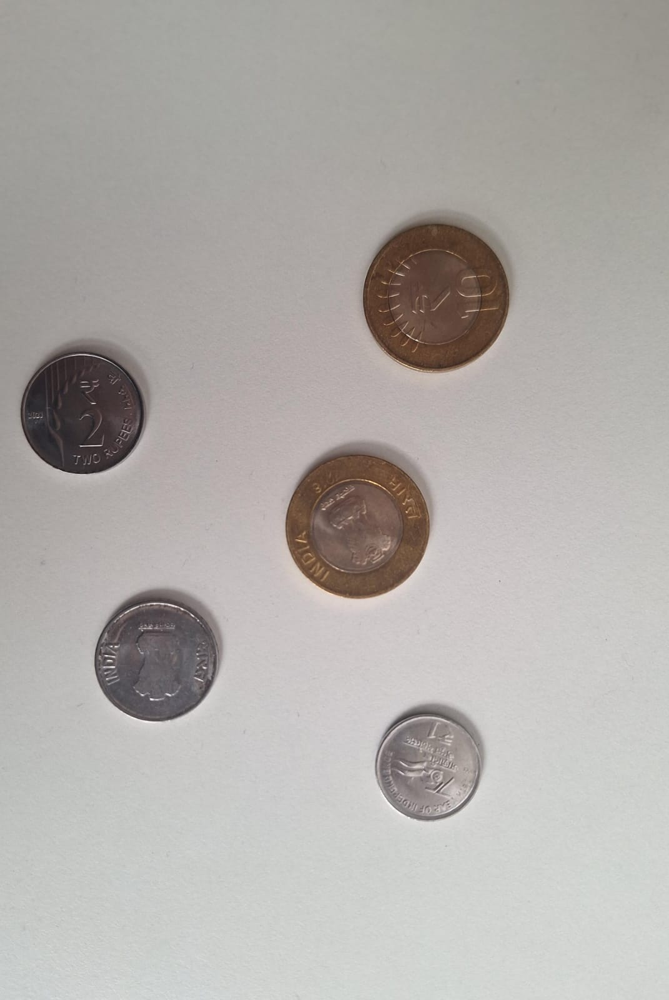

# VR_Assignment1_SamyakJain_IMT2022071
# Coin Detection and Panorama Stitching Project

This project involves two main tasks:

1. **Coin Detection and Segmentation**: Detecting and counting scattered Indian coins in images using computer vision techniques.
2. **Panorama Stitching**: Stitching multiple overlapping images into a single panoramic image using key points detection and image alignment.

## Part 1: Coin Detection and Segmentation

In this section, we use edge detection (Canny edge detection) to detect and outline the coins in an image. The coins are then segmented using region-based segmentation techniques to isolate individual coins.

### Steps:
1. **Detect Coins**: The edges are detected using the Canny algorithm, and contours are drawn to visualize the detected coins.
2. **Segment Coins**: Region-based segmentation techniques are used to isolate and display each coin individually.

### Visual Output for Part 1
#### Original image



#### 1. Canny Edge Detection
This image shows the edges detected using the Canny algorithm. The edges are the initial step in identifying the coins.


#### 2. Contours of Detected Coins
This image shows the contours drawn around each detected coin. The coins are highlighted with green lines.


#### 3. Segmented Coins
This image shows each coin individually isolated after segmentation.


---

## Part 2: Panorama Stitching

In this part, multiple overlapping images are stitched together into a single panoramic image. Key points are extracted from the images, matched, and used to compute a homography matrix to align the images. The resulting panorama is cropped to remove black borders.

### Steps:
1. **Extract Key Points**: Key points from overlapping images are detected using the ORB detector.
2. **Image Stitching**: The images are aligned and stitched together using the matched key points and homography transformation.
3. **Cropping the Final Panorama**: Any black borders on the final stitched image are cropped to provide a clean output.

### Visual Output for Part 2

#### 1. Key Points Detection
This image shows the key points detected in the overlapping images using the ORB detector.


#### 2. Final Stitched Panorama
This is the final stitched panorama image, showing the result of aligning and stitching the images together.


---

## Installation

To run this project, you need Python 3.x and the required dependencies.

### Step 1: Clone the repository
```bash
git clone https://github.com/yourusername/coin-detection-panorama.git
cd coin-detection-panorama
